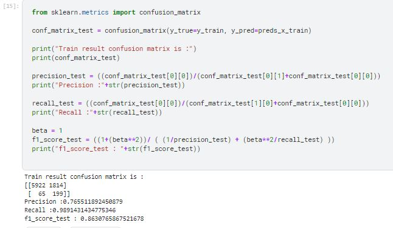

# Anomaly-Detection
Anomaly Detection deployed on machine data dataset for Predictive Maintenance .

* Project - Predictive Maintainence Anomaly Detection
* Skills - Anomaly Detection, Multivariate Gaussian, Unsupervised Learning, Data Visualisation, Exploratory Data Analysis, Data Science, Machine Learning
* Tools - Google Colab, Jupyter Notebooks, Python, Numpy, Pandas, Matplotlib, Seaborn, Sklearn

 ### Real Life Application :
This can be deployed in an Industrial Internet of Things (IIoT) System, where the system variables measured throught the sensors are sent to Processing System (ofc with my algorithm inside
it) and can be used to monitor system health and predict need for maintainence in the Mechatronic System. Since Prevention is better than cure, a maintainence before any damage or major
inconvenience happens is better, hence our system can reduce maintainence costs thus being a business boon.

### The Dataset :
The data was taken from Kaggle site : https://www.kaggle.com/datasets/shivamb/machine-predictive-maintenance-classification .

A copy of the dataset has been uploaded on this repository just in case the kaggle one gets changed: [https://github.com/prachitui/Anomaly-Detection/blob/main/predictive_maintenance.csv](https://github.com/prachitui/Anomaly-Detection/blob/main/predictive_maintenance.csv)

### Aim :
To build an Anomaly Detection system for Predictive Maintainence work on Machines data using Multivariate Gaussian fitting and thresholding, a simple unsupervised learning technique.

### Result:

The Confusion Matrix was satisfactory, and the F1 score of my model was in range of that of competitors
[https://www.kaggle.com/datasets/shivamb/machine-predictive-maintenance-classification/code](https://www.kaggle.com/datasets/shivamb/machine-predictive-maintenance-classification/code) 
who have used advanced techniques such as XGBoost, hence showing that the project was successful. Furthermore, the threshold can be shifted to decrease the number of false negatives.
The data is as such that the anomalies and the non anomalies are a bit mixed, and hence we can't expect extreme high accuracies. F-Beta Score can also be considered as a better marking
factor here if we wanted to emphasise over false negatives over the cost of false positives .
